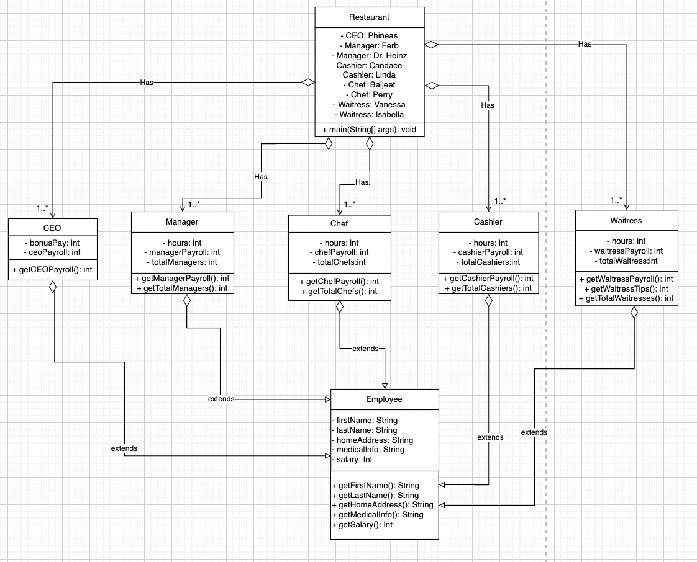

# ICS4U OOP Assignment

[*see instructions for details*](Instructions.md)

*Insert Class Diagram here*  

## Summary
*Include a brief summary that describes your system that your are modelling*

The system being modelled is a information system about the staff at an American restaurant. This program allows the user to check all the employees information as well as add new employees to the list. The employees are the Cashiers, Chefs, Managers, and Waitresses. The program provides information such as the employee’s first name, last name, home address, medical information, and salary. The user can go through each position in the restaurant from CEO to the Waitress as well as a summary report about the number of employees and payroll.
