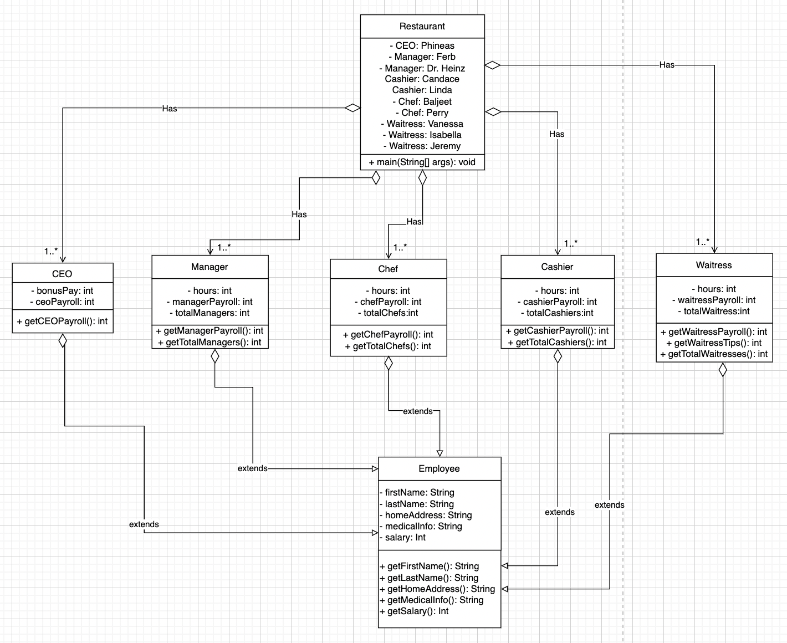

# ICS4U OOP Assignment

[*see instructions for details*](Instructions.md)

*Insert Class Diagram here*  

## Summary
*Include a brief summary that describes your system that your are modelling*

The system being modelled is a information system about the staff at an American restaurant. The user is a new hire staff member that is using the restaurant information system to learn more information about the CEO, Cashiers, Chefs, Head chefs, Managers, and Waitresses. The program provides information such as the employee’s first name, last name, home address, medical information, and salary. Depending on the position of the employee such as Manager vs a Waitress, there is other information provided. The user will go through each position in the restaurant from CEO to the Waitress and at the end, a report about the number of employees and payroll is provided.
